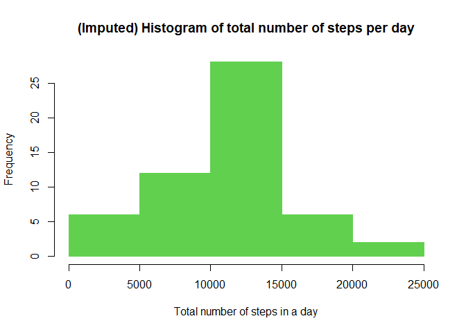

# Loading and preprocessing the data
### 1. Load the data


```r
library(data.table)
data <- read.csv(unz("activity.zip", "activity.csv"))
new_data <- na.omit(data)
```
### 2. Process/transform the data (if necessary) into a format suitable for your analysis

```r
new_data <- na.omit(data)
# create data table
dt <- data.table(new_data)
# create data frame of total steps
df <- as.data.frame(dt[, list(total = sum(steps)), by = c("date")])
```
# What is mean total number of steps taken per day?
### 1. Make a histogram of the total number of steps taken each day


```r
hist(df$total, col=3, main="Histogram of the total number of steps per day", 
     xlab="Total number of steps per day", border = 3)
```

<!-- -->

### 2. Calculate and report the mean and median total number of steps taken per day

```r
mean1 <- mean(df$total)
median1 <- median(df$total)
```
The mean is 1.0766189\times 10^{4} or 10766 and the median is 10765 

# What is the average daily activity pattern?

### 1. Make a time series plot (i.e. \color{red}{\verb|type = "l"|}type = "l") of the 5-minute interval (x-axis) and the average number of steps taken, averaged across all days (y-axis)

```r
#  data for plot
interval_steps <- aggregate(steps ~ interval, new_data, mean)
#create time series
plot(interval_steps$interval, interval_steps$steps, type='l', col=1, 
     main="Average number of steps averaged across all days", xlab="Interval", 
     ylab="Average number of steps")
```

<!-- -->

### 2. Which 5-minute interval, on average across all the days in the dataset, contains the maximum number of steps?

```r
# find row id of maximum average number of steps in an interval
max_row_id <- which.max(interval_steps$steps)

# get the interval with maximum average number of steps in an interval
interval_steps [max_row_id, ]
```

```
##     interval    steps
## 104      835 206.1698
```

The interval 835 has the maximum average value of steps (206.1698).

# Imputing missing values

### 1. Calculate and report the total number of missing values in the dataset (i.e. the total number of rows with NAs).


```r
# get rows with NA's
data_NA <- data[!complete.cases(data),]

# number of rows
NArows <- nrow(data_NA)
```

The number of rows with NAs is 2304

### 2. Devise a strategy for filling in all of the missing values in the dataset. The strategy does not need to be sophisticated. For example, you could use the mean/median for that day, or the mean for that 5-minute interval, etc.

### 3. Create a new dataset that is equal to the original dataset but with the missing data filled in.

```r
for (i in 1:nrow(df)){
  if (is.na(data$steps[i])){
    interval_val <- data$interval[i]
    row_id <- which(interval_steps$interval == interval_val)
    steps_val <- interval_steps$steps[row_id]
    data$steps[i] <- steps_val
  }
}
```

### 4. Make a histogram of the total number of steps taken each day and Calculate and report the mean and median total number of steps taken per day. Do these values differ from the estimates from the first part of the assignment? What is the impact of imputing missing data on the estimates of the total daily number of steps?

```r
# aggregate steps as per date to get total number of steps in a day
inserted <- aggregate(steps ~ date, data, sum)

# create histogram of total number of steps in a day
hist(inserted$steps, col=3, border = 3, main="(Imputed) Histogram of total number of steps per day", xlab="Total number of steps in a day")
```

<!-- -->

```r
mean2 <- mean(inserted$steps)
median2 <- median(inserted$steps)
```
Mean with imputed values is 1.0567 × 104 or 10567 whereas previously it was 1.0766 × 104 or 10766. The median with imputed values is 1.0682 × 104 or 10682 whereas it was 10765 before. Therefore the mean is reduced by 199 there is a difference of 83 to the median.

# Are there differences in activity patterns between weekdays and weekends?

### 1. Create a new factor variable in the dataset with two levels – “weekday” and “weekend” indicating whether a given date is a weekday or weekend day.


```r
# Create a new factor variable in the dataset with two levels – “weekday” and “weekend” indicating whether a given date is a weekday or weekend day.
day <- weekdays(as.Date(data$date))
daylevel <- vector()
for (i in 1:nrow(data)) {
    if (day[i] == "Saturday") {
        daylevel[i] <- "Weekend"
    } else if (day[i] == "Sunday") {
        daylevel[i] <- "Weekend"
    } else {
        daylevel[i] <- "Weekday"
    }
}
data$daylevel <- daylevel
data$daylevel <- factor(data$daylevel)

stepsByDay <- aggregate(steps ~ interval + daylevel, data = data, mean)
names(stepsByDay) <- c("interval", "daylevel", "steps")
```

### 2. Make a panel plot containing a time series plot (i.e. type = “l”) of the 5-minute interval (x-axis) and the average number of steps taken, averaged across all weekday days or weekend days (y-axis).


```r
# make the panel plot for weekdays and weekends
library(lattice)

# create the panel plot
xyplot(steps ~ interval | daylevel, stepsByDay, type = "l", layout = c(1, 2), 
    xlab = "Interval", ylab = "Number of steps")
```

<!-- -->
